```{r setup, include=FALSE}
# Presentazione preparata da Michele Scandola per la scuola di dottorato univr
# 
# Licenza cc by-nc 4.0

library(fontawesome)
library(knitr)
library(afex)
library(reshape2)
library(ggplot2)
library(gridExtra)
knitr::opts_chunk$set(echo = FALSE)

GimmeStar <- function(p, not_trend = FALSE){
  if (is.na(p)) {warning("presence of NAs");return("")}
  if (p>0.10) return("")
  if (p>0.05 & !not_trend) return("+")
  if (p>0.01) return("*")
  if (p>0.001) return("**")
  else return("***")
}
```

## Table of topics

<p class="top-three">

> 1.  Replication crisis <br>
> 2.  The reasons of the replication crisis <br>
> 3.  Questionable research practices <br>
> 4.  Non-questionable research practices <br>
> 5.  What is Open science? <br>

</p>


## The Action-Sentence Compatibility Effect [@glenberg2002grounding]

::: center
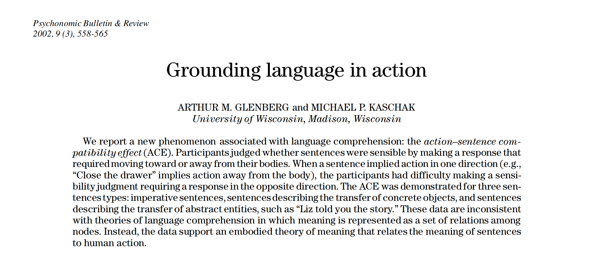
:::

## 

::: center
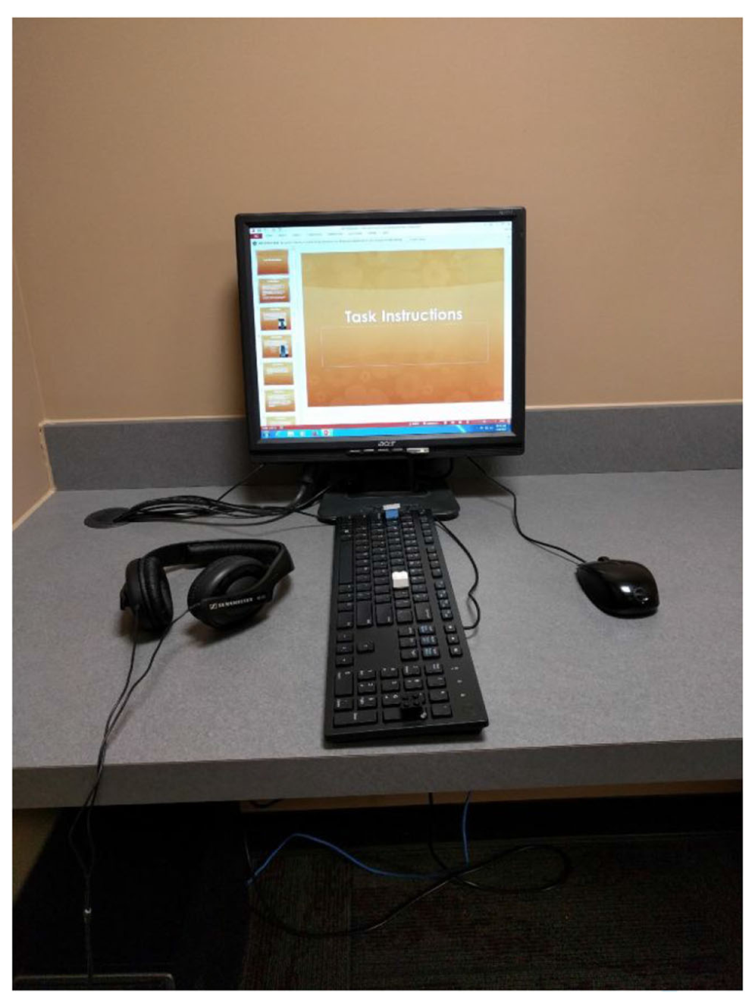
:::

## 

::: center
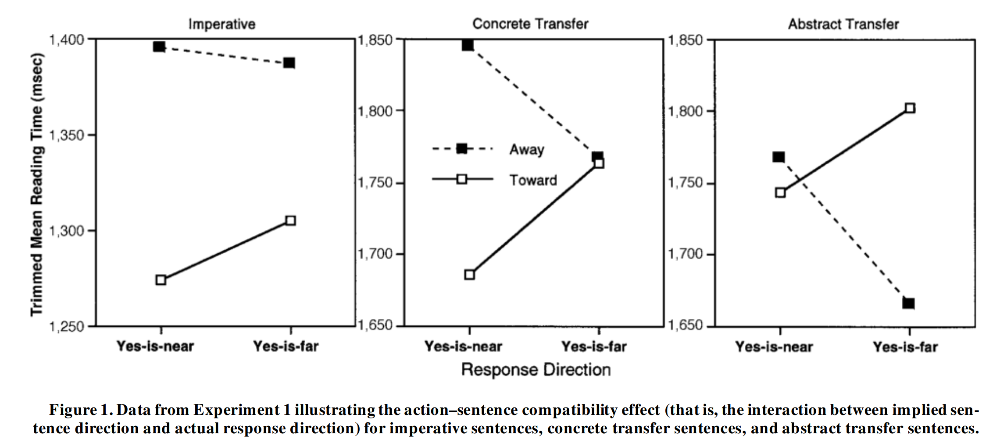
:::

<p style="margin-bottom:14cm;">

</p>

3087 citations on Google Scholar so far.

## 

::: center
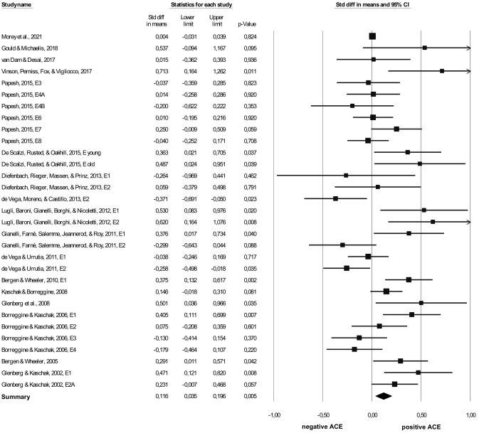
:::

<p style="margin-bottom:14cm;">

</p>

> publication bias

## 

::: center
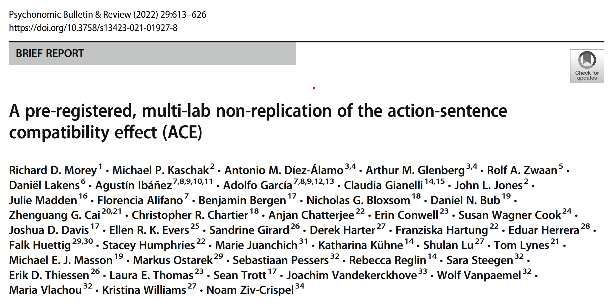
:::

## 

::: center
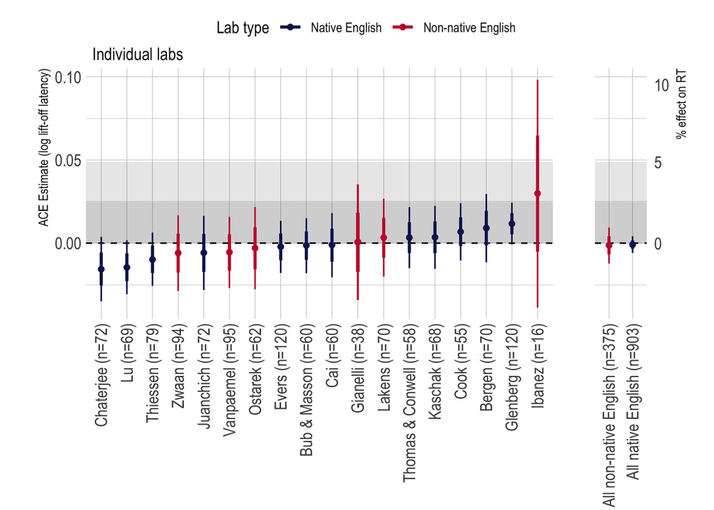
:::

<p style="margin-bottom:14cm;">

</p>

> Effects compatible with original findings should be above the grey area

72 citations on Google Scholar so far.

## Tumor suppressor PTEN [@tay2011coding] 1/2

::: center
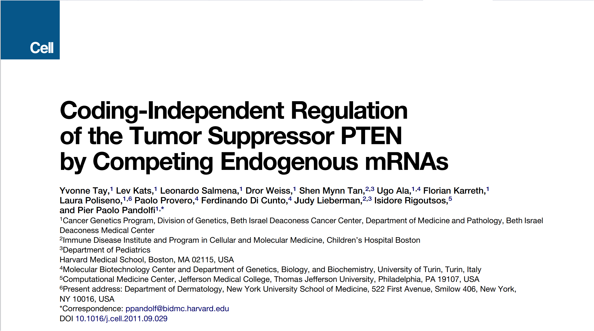
:::

<p style="margin-bottom:14cm;">

</p>

1079 citations on Google Scholar so far.

## Tumor suppressor PTEN - replication [@wang2020replication] 2/2

::: center
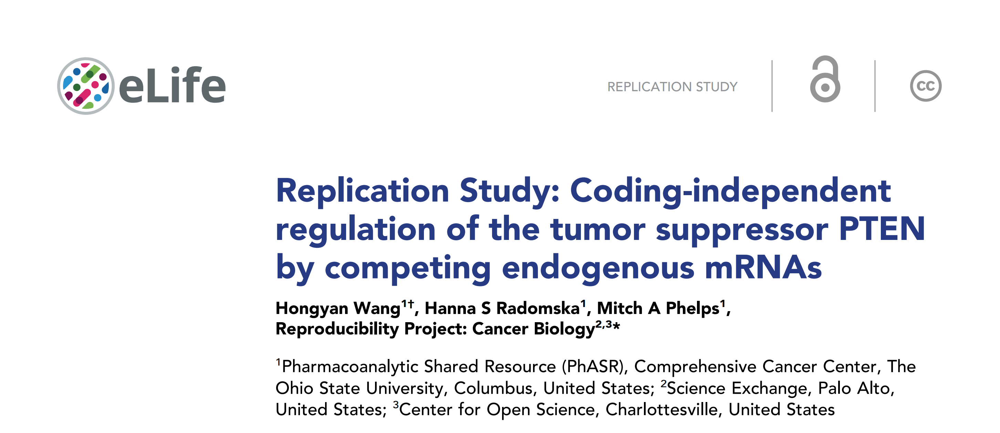
:::

<p style="margin-bottom:14cm;">

</p>

6 citations on Google Scholar so far.

## 

<p style="margin-bottom:7cm;">

</p>

<blockquote>

-   Ioannidis in 2005 published "Why Most Published Research are false" [@ioannidis2005most].

-   There is a growing realization that statistically significant claims in scientific publications are routinely mistaken. [@gelman2013garden]

</blockquote>

## 

<p class="top-three">

> 1.  **Replication crisis** <br>
> 2.  The reasons of the replication crisis <br>
> 3.  Questionable research practices <br>
> 4.  Non-questionable research practices <br>
> 5.  What is Open science? <br>

</p>


## Replication crisis

<p style="text-align: center;">

```{r}
dat <- data.frame(
  y = c(64, 36, 100-46, 46, 100 - 17, 17),
  x = c("Psychology", "Psychology",
        "Cancer Biology", "Cancer Biology",
        "SCI research", "SCI research"),
  type = c("Not replicated", "Replicated",
           "Not replicated", "Replicated",
           "Not replicated", "Replicated")
)

ggplot(data = dat, mapping = aes(x="", y=y, fill=type)) +
  geom_bar(stat="identity", width=1, color="white") +
  coord_polar("y", start=0) +
  facet_grid(~x)+
  theme_void()+
  scale_fill_brewer(palette = "Set1")+
  theme(legend.position = "bottom",
        legend.direction = "horizontal",
        legend.title = element_blank())
```

</p>

The *Reproducibility Project: Cancer Biology* [@errington2021investigating] was able to replicate the 46% out of 112 studies.

The *Open Science Collaboration* in 2015 [@open2015estimating] was able to replicate the 36% out of 100 studies.

The *FORE-SCI* project in 2012 [@steward2012replication] was able to replicate the 17% out of 12 studies.

-   but... *what exactly means replication?*

<!-- “Reproducibility” refers to instances in which the original researcher's data and computer codes are used to regenerate the results, while “replicability” refers to instances in which a researcher collects new data to arrive at the same scientific findings as a previous study. -->

##

### What is replication?

<blockquote>

-   Repeating a study's procedure and observing whether the prior finding recurs

</blockquote>

-   This definition is [@nosek2020replication]:

    -   intuitive
    -   easy to apply
    -   INCORRECT

-   E.g.: behavioural experiment conducted in USA in English --\> replication in the Philippines with a Tagalog-speaking sample

<blockquote>

-   Replications often repeat procedures because theories are too vague and methods too poorly understood to productively conduct replications and advance theoretical understanding otherwise

</blockquote>

##

### What is replication?

Direct v. Conceptual replication [@crandall2016scientific]

![From <http://noba.to/q4cvydeh> direct v. conceptual replication of Asch's classic findings on conformity [@asch1956studies]](imgs/direct_conceptual_replication.jpg)

According to [@nosek2020replication] conceptual replications are actually generalisations of the findings.

##

### What is replication?

<blockquote>

-   Replication is a study for which any outcome would be considered diagnostic evidence about a claim from prior research. [@nosek2020replication]

</blockquote>

-   outcomes consistent with a prior claim would increase confidence in the claim
-   outcomes inconsistent with a prior claim would decrease confidence in the claim

![From [@nosek2020replication]](imgs/nosek_replication.png)

## 

<p class="top-three">

> 1.  ~~Replication crisis~~ <br>
> 2.  **The reasons of the replication crisis** <br>
> 3.  Questionable research practices <br>
> 4.  Non-questionable research practices <br>
> 5.  What is Open science? <br>

</p>


## The Reasons of the replication crisis

<p style="margin-bottom:7cm;">

</p>

-   Questionable Research Practices
-   Replicating and failing in replicating studies is a standard aspect of the scientific method

## 

<p class="top-three">

> 1.  ~~Replication crisis~~ <br>
> 2.  ~~The reasons of the replication crisis~~ <br>
> 3.  **Questionable research practices** <br>
> 4.  Non-questionable research practices <br>
> 5.  What is Open science? <br>

</p>


## Questionaible Research Practices

[The 7 deadly sins of research](https://www.nature.com/nature-index/news/the-seven-deadly-sins-of-research)

> For almost a century, scientists have used the 'p-value' to determine whether their results are due to a real effect or simply chance. With the pressure to publish only significant results, some researchers may be tempted to push their p-values to below the cutoff.

-   P-hacking
-   HARKing (Hypothesizing After Results Are Known)
-   Cherry-picking data
-   Data fabrication
-   Salami slicing
-   Not publishing negative results
-   Double-dipping

##

### P-hacking

P-hacking can be as simple as removing pesky outliers during analysis or as laborious as running several analyses until significant results are achieved.

> "The problem isn't that it is bad to collect more data," says MacCoun. "The problem is created when we only do that for hypotheses we like and want to support, and when editors only publish the subset of studies that cross that threshold."

```{r}
set.seed(1)

inputPanel(
  ## the data was actually generated before-hand
  actionButton("generate_button",
               label = "Generate the data.",
               class = "btn-success"),
  actionButton("add_button",
               label = "Add a single trial in nearly significant studies",
               class = "btn-warning")
)

renderPlot({
  if( (input$generate_button) != 0 ){
    
    n_obs_per_trial <- 10
    n_trials <- 20000
    ps <- rep(NA, times = n_trials)
    
    y <- matrix(nrow = n_trials, ncol = n_obs_per_trial)
    x <- matrix(nrow = n_trials, ncol = n_obs_per_trial)
    
    set.seed(1)
    for(i in 1:n_trials){
      
      y[i,] <- rnorm(n_obs_per_trial, sd = 3)
      x[i,] <- rnorm(n_obs_per_trial, sd = 3)
      
      ps[i] <- t.test(y[i,], x[i,], var.equal = TRUE)$p.value
      
    }
    
    graph <- data.frame(
      y = ps,
      x = ifelse(ps < 0.05, "p < 0.05",
                 ifelse(ps < 0.1, "<",
                        "grey"))
    )
    
    ggplot(graph, aes(x=y, fill = x))+
      geom_histogram(aes(y = after_stat(count / sum(count))),
                     breaks = seq(from = 0, to = 1, by = 0.05),
                     colour = "white")+
      scale_fill_manual(values = c("blue", "grey", "red"))+
      geom_abline(intercept = 0.05, slope = 0, colour = "purple")+
      xlab("")+ylab("")+ylim(c(0,0.07))
  }
}
)

renderPlot({
  if(input$add_button != 0){
    n_obs_per_trial <- 10
    n_trials <- 20000
    ps <- rep(NA, times = n_trials)
    
    y <- matrix(nrow = n_trials, ncol = n_obs_per_trial)
    x <- matrix(nrow = n_trials, ncol = n_obs_per_trial)
    
    set.seed(1)
    for(i in 1:n_trials){
      
      y[i,] <- rnorm(n_obs_per_trial, sd = 3)
      x[i,] <- rnorm(n_obs_per_trial, sd = 3)
      
      ps[i] <- t.test(y[i,1:10], x[i,1:10], var.equal = TRUE)$p.value
      
    }
    
    ps2 <- ps
    
    set.seed(15527)
    for(i in 1:n_trials){
      if(ps2[i] >= 0.05 & ps2[i] < 0.1){
        ps2[i] <- t.test(
          c(y[i,],rnorm(n=1, sd = 3)),
          c(x[i,],rnorm(n=1, sd = 3)),
          var.equal = TRUE)$p.value
      }
    }
    
    graph <- data.frame(
      y = ps2,
      x = ifelse(ps2 < 0.05, "red",
                 ifelse(ps2 < 0.1, "blue",
                        "grey"))
    )
    
    
    ggplot(graph, aes(x=y, fill = x))+
      geom_histogram(aes(y = after_stat(count / sum(count))),
                     breaks = seq(from = 0, to = 1, by = 0.05),
                     colour = "white")+
      scale_fill_manual(values = c("blue", "grey" ,
                                   "red"))+
      geom_abline(intercept = 0.05, slope = 0, colour = "purple")+
      xlab("")+ylab("")+ylim(c(0,0.07))
  }
}
)


```

##

### HARKing (Hypothesizing After Results Are Known)

> Presenting 'post-results hypotheses' as if they were created before an experiment and leaving out the original hypotheses when reporting results are examples of HARKing.

> A 2017 analysis of six recent surveys on HARKing self-admission rates found that 43% of researchers have HARKed at least once in their career.

##

### Cherry-picking data

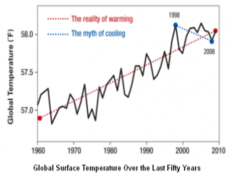

## 

### Cherry-picking results (fishing) 1/2

Let's imagine that we want to understand if we are able to connect laterality cues to motor answers faster with the upper or the lower limbs.

Therefore, we prepared an experiment, where participants had to listen or read the words "Left" or "Right" (**cue**) and, as fast as they can, correctly press the corresponding button (in the "hands" **block**) or pedal (in the "feet" **block**).

Each cue was repeated 20 times per **block:cue** combination, and we collected data from 30 participants (half males, half females).

```{r}
## DATA GENERATION
## this dataset is generated to purposely
## simulate a "fishing" behaviour
## for this reason, data will be generated
## and accepted only if a key factor is not
## significant in two ANOVAs, while significant
## only in a third ANOVA.

n_block <- 2
n_cue   <- 2
n_subj  <- 30
n_item  <- 20

i <- 1

repeat{
  
  dat <- data.frame(
    block = gl(n_block, n_cue * n_subj * n_item,
               labels = c("Hands", "Feet")), 
    subj  = rep(1:n_subj, 
                length = n_cue * n_block * n_item * n_subj),
    cue   = gl(n_cue, n_subj,
               labels = c("L", "R"),
               length = n_cue * n_block * n_item * n_subj)
  )
  
  set.seed(i)
  
  dat$RT <- rnorm(
    mean = 1.5 + ifelse(dat$block == "Feet", 0.08, 0),
    n = n_cue * n_block * n_item * n_subj
  ) +
    rexp(
      n = n_cue * n_block * n_item * n_subj
    )
  
  dat$correct <- rbinom(
    n = n_cue * n_block * n_item * n_subj,
    prob = 0.95,
    size = 1)
  
  dat$sex <- factor( ifelse(
    dat$subj < 11, "F", "M"
  ) )
  
  dat$RT <- ifelse(dat$RT <= 0, abs(dat$RT) + 0.1, dat$RT)
  
  ## apply constrains for fishing simulation
  tmp_dat <- droplevels(
    dat[dat$correct == 1,]
  )
  
  tmp_dat$y <- log(tmp_dat$RT)
  
  out <- boxplot.stats(
    tmp_dat$y
  )$out
        
  tmp_dat <- droplevels(
    tmp_dat[-which(tmp_dat$y %in% out),]
  )
  
  mdl1 <- aov_4( y ~ block * cue + sex+
                   (block * cue | subj),
                 data = tmp_dat,
                 fun_aggregate = mean)
  
  mdl2 <- aov_4( y ~ block * cue +
                   (block * cue | subj),
                 data = tmp_dat,
                 fun_aggregate = mean)
  
  mdl3 <- aov_4( y ~ block+
                   (block | subj),
                 data = tmp_dat,
                 fun_aggregate = mean)
  if(
    mdl1$anova_table$`Pr(>F)`[2] < 0.05 &
    mdl2$anova_table$`Pr(>F)`[1] > 0.05 &
    mdl3$anova_table$`Pr(>F)`[1] > 0.05
  )  break(   )
  i <- i + 1
}
```

```{r}
inputPanel(
  ## the data was actually generated before-hand
  actionButton("generate_button_3",
               label = "Generate the data.",
               class = "btn-success")
)

renderPlot({
    if( (input$generate_button_3) != 0 ){
      hist(dat$RT)
    }
  }
)

renderDataTable({
    if( (input$generate_button_3) != 0 ){
      dat
    }
  }
)
```

##

### Cherry-picking results (fishing) 2/2

Research question: Are we faster in connecting laterality cues to motor answers with the upper or the lower limbs?

```{r}
inputPanel(
  radioButtons("rb_trans",
               "Do you want to apply a transformation to the reaction times?",
               choiceNames = 
                 list(
                   "Raw RT", 
                   "log(RT)", 
                   "sqrt(RT)"
                 ),
               choiceValues =
                 list(
                   "Raw RT", 
                   "log(RT)", 
                   "sqrt(RT)"
                 )
  ),
  
  
  radioButtons("rb_correct",
               "Do you want to consider only correct responses?",
               choiceNames = list("Yes", "No"),
               choiceValues = list(TRUE, FALSE)),
  
  radioButtons("rb_outliers",
               "How do you want to remove outliers?",
               choiceNames = list("Boxplot rule", "Gaussian rule"),
               choiceValues = list(TRUE, FALSE)),
  
  checkboxGroupInput("cb_factors",
                     "Which independent variables do you want to consider?",
                     c("Block factor (Hands/Feet)" = "fct_block",
                       "Cue factor (Left/Right)" = "fct_cue",
                       "Sex factor (M/F)" = "fct_sex")),
  
  radioButtons("rb_analysis",
               "Do you want to execute an ANOVA, or a glm on a Gamma distribution?",
               choiceNames = list("ANOVA", "GLM"),
               choiceValues = list(TRUE, FALSE)),
  
  actionButton("compute_button",
               label = "Compute the analysis.",
               class = "btn-success"),
  
  actionButton("secret_button",
               label = "Secret button.",
               icon = icon("user-ninja"))
)

sidebarLayout(
  mainPanel(
    renderText(
      if( (input$compute_button) != 0 ){
        f1 <- ifelse(
          sum( input$cb_factors == "fct_block") > 0,
          " + block", ""
        )
        f2 <- ifelse(
          sum( input$cb_factors == "fct_cue") > 0,
          " + cue", ""
        )
        f3 <- ifelse(
          sum( input$cb_factors == "fct_sex") > 0,
          " + sex", ""
        )
        f4 <- ifelse(
          sum( input$cb_factors == "fct_cue") > 0 &
            sum( input$cb_factors == "fct_block") > 0,
          " + block:cue", ""
        )
        
        r1 <- ifelse(
          sum( input$cb_factors == "fct_block") > 0,
          " + block", ""
        )
        r2 <- ifelse(
          sum( input$cb_factors == "fct_cue") > 0,
          " + cue", ""
        )
        r3 <- ifelse(
          sum( input$cb_factors == "fct_cue") > 0 &
            sum( input$cb_factors == "fct_block") > 0,
          " + block:cue", ""
        )
        
        form <- paste0("y ~ 1", f1, f2, f3, f4,
                       " + (1", r1, r2, r3, "| subj)"
        )
        
        print(form)
      }
    ),
    
    renderTable({
      if( (input$compute_button) != 0 ){
        new_dat   <- dat
        new_dat$y <- new_dat$RT
        
        if(input$rb_trans == "log(RT)"){
          new_dat$y <- log(new_dat$y)
        }
        
        if(input$rb_trans == "sqrt(RT)"){
          new_dat$y <- sqrt(new_dat$y)
        }
        
        if(input$rb_correct){
          new_dat <- droplevels(
            new_dat[new_dat$correct == 1,]
          )
        }
        
        if(input$rb_outliers){
          out <- boxplot.stats(
            new_dat$y
          )$out
          
          new_dat <- droplevels(
            new_dat[-which(new_dat$y %in% out),]
          )
        } else {
          mm <- mean(new_dat$y)
          ss <- sd(new_dat$y)
          
          out <- which(
            new_dat$y < (mm - 2 * ss) |
              new_dat$y > (mm + 2 * ss)
          )
          
          new_dat <- droplevels(
            new_dat[-out,]
          )
        }
        
        f1 <- ifelse(
          sum( input$cb_factors == "fct_block") > 0,
          "+ block", ""
        )
        f2 <- ifelse(
          sum( input$cb_factors == "fct_cue") > 0,
          "+ cue", ""
        )
        f3 <- ifelse(
          sum( input$cb_factors == "fct_sex") > 0,
          "+ sex", ""
        )
        f4 <- ifelse(
          sum( input$cb_factors == "fct_cue") > 0 &
            sum( input$cb_factors == "fct_block") > 0,
          "+ block:cue", ""
        )
        
        r1 <- ifelse(
          sum( input$cb_factors == "fct_block") > 0,
          "+ block", ""
        )
        r2 <- ifelse(
          sum( input$cb_factors == "fct_cue") > 0,
          "+ cue", ""
        )
        r3 <- ifelse(
          sum( input$cb_factors == "fct_cue") > 0 &
            sum( input$cb_factors == "fct_block") > 0,
          "+ block:cue", ""
        )
        
        form <- paste0("y ~ 1", f1, f2, f3, f4,
                       " + (1", r1, r2, r3, "| subj)"
        )
        
        if(input$rb_analysis){
          tab <- aov_4(
            formula = as.formula(form),
            data = new_dat
          )$anova_table
        } else {
          mdl <- glmer(
            formula = as.formula(form),
            family = "Gamma",
            data = new_dat
          )
          
          tab <- car::Anova(
            mdl, type = 3
          )
        }
        
        tab
      }
    }, rownames = TRUE
    )
  ),
  sidebarPanel(
    renderImage({
      if( (input$secret_button) != 0 ){
        list(src = 'imgs/sampei.jpg')
      }else list(src = "")
    }, deleteFile = FALSE)
  )
)
```

##

### Data fabrication

A 2009 systematic review and meta-analysis of 39 global surveys on research misconduct published in PLoS One [@fanelli2009many] found that almost 2% of scientists on average admitted to fabricating data at least once, but around 14% of researchers have witnessed colleagues falsifying results.

In 2018, a [Retraction Watch report](https://www.science.org/content/article/what-massive-database-retracted-papers-reveals-about-science-publishing-s-death-penalty) on roughly 10,500 papers revealed that half of all retractions over the past two decades were due to fraud.

##

### Salami slicing

For some researchers, a large dataset is considered a surefire way to publish multiple papers for the price of one.

Known as salami slicing, the process involves splitting a dataset into smaller chunks and writing separate papers on these 'sliced' results. 'Salami publications' share the same hypotheses, samples, and methods, which can result in misleading findings.

A 2019 analysis of more than 55,000 health science papers revealed that the number of publications per study increased by more than 20% between 1970 and 2014.

## 

### Not publishing negative results

Journals are biased towards publishing studies that find effects, and this makes it difficult for researchers to publish non-significant results. This bias can deter researchers from even attempting to publish their 'failed' studies, perpetuating the cycle further.

"People only publish when something works, and never when it doesn't," says Jean-Jacques Orban de Xivry, a neuroscientist at the Catholic University of Leuven in Belgium. "This means that we only publish half of the studies that we produce in laboratories. That's troubling to me."

According to a study of 221 social science experiments, only 21% of null findings make their way into the pages of a journal and two-thirds are never written up. By contrast, more than 95% of the experiments that produced positive findings are included in manuscripts, and more than half end up being published.

## 

### Double-dipping

Circular analysis, also known as double-dipping, involves using the same data multiple times to achieve a significant result.

As Orban de Xivry explains, double-dipping also includes "analyzing your data based on what you see in the data," leading to inflated effects, invalid conclusions, and false positive results.

Double-dipping is particularly rife in neuroimaging studies, according to a 2009 paper led by neuroscientist, Nikolaus Kriegeskorte, from the US National Institute of Mental Health. The analysis found that 42% of papers on functional magnetic resonance imaging (fMRI) experiments published in leading journals were bolstered by circular analysis.

A 2019 paper published in eLife, Orban de Xivry recommends that researchers develop a clear outline of analysis criteria before diving into the data to avoid falling into the double-dipping trap.

## 

<p class="top-three">

> 1.  ~~Replication crisis~~ <br>
> 2.  ~~The reasons of the replication crisis~~ <br>
> 3.  ~~Questionable research practices~~ <br>
> 4.  **Non-questionable research practices** <br>
> 5.  What is Open science? <br>

</p>


## Non-Questionaible Research Practices

### Dance of p-values [@cumming2014new]

Simulation of 50 obervations with effect size Cohen's d = 0.5

```{r}
set.seed(1)

inputPanel(
  ## the data was actually generated before-hand
  actionButton("generate_button_2",
               label = "Generate the data.",
               class = "btn-success")
)

renderPlot({
  if( (input$generate_button_2) != 0 ){

    out <- list()
    
    for(i in 1:25){
      y <- rnorm(n = 50, mean = 0.5)
      
      p <- t.test(y)$p.value
      m <- mean(y)
      ci <- quantile(y, probs = c(0.025,0.975))
      
      out[[i]] <- data.frame(
        p       = p,
        mean    = m,
        ci_low  = ci[1],
        ci_high = ci[2],
        i = i
      )
    }
    
    out <- do.call("rbind", out)
    
    ggplot(out, aes(y = m, ymin = ci_low, ymax = ci_high, x = i, colour = p < 0.05))+
      geom_pointrange()+
      geom_text(y = max(out$ci_high)+0.1, aes(x = i, label = round(p, 3)))+
      theme_bw()+
      coord_flip()+
      xlab("")+ylab("")+
      scale_color_brewer(palette = "Set1")
    }
  }
)

```

##

::: center
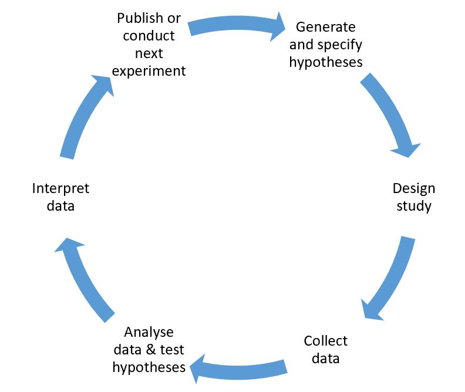
:::

##

::: center
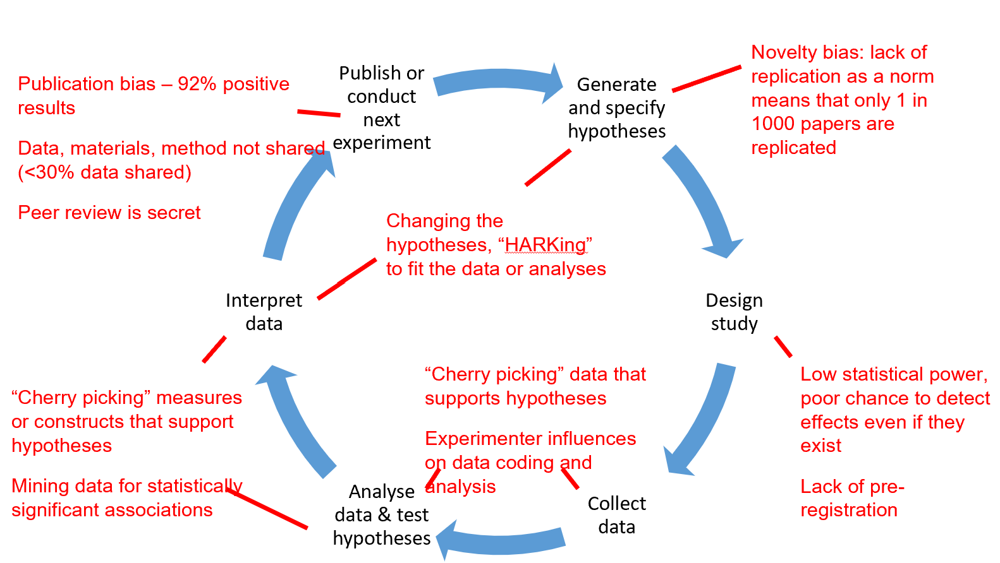
:::

## 

<p class="top-three">

> 1.  ~~Replication crisis~~ <br>
> 2.  ~~The reasons of the replication crisis~~ <br>
> 3.  ~~Questionable research practices~~ <br>
> 4.  ~~Non-questionable research practices~~ <br>
> 5.  **What is Open science?** <br>

</p>


## What is open science?

::: center2

:::

<p style="margin-bottom:14cm;">

</p>

Open Science is an approach based on open  **cooperative work** and **systematic sharing** of  **knowledge** and **tools** as early and widely as  possible in the process.

##

::: center

:::

## 

### Open Access 1/3

**Definition of Open Access**

Open Access implies free access to scientific knowledge for everybody.  In the "Berlin Declaration on Open Access to Knowledge in the Sciences  and Humanities", the term scientific knowledge is defined as "original  scientific research results, raw data and metadata, source materials,  digital representations of pictorial and graphical materials and scholarly  multimedia material"


## 

### Open Access 2/3

Predatory publishing

<p align="middle">
  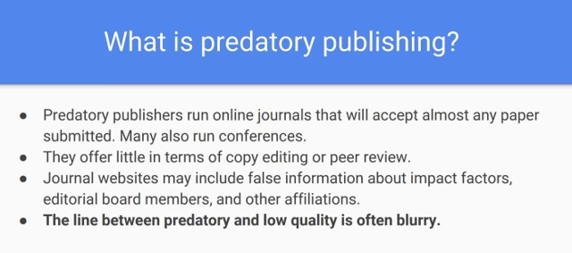
  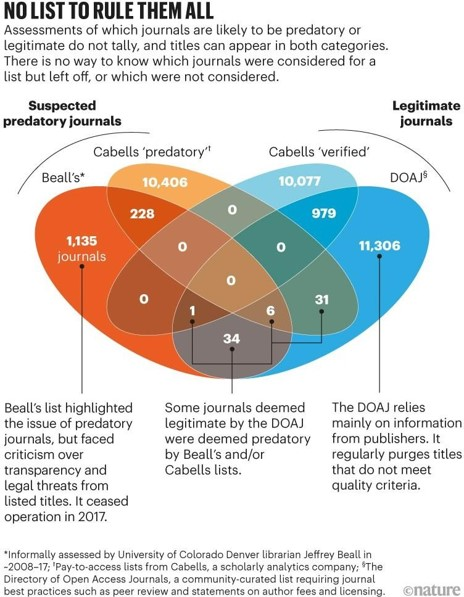 
</p>

## 

### Open Access 3/3

Predatory publishing

::: center
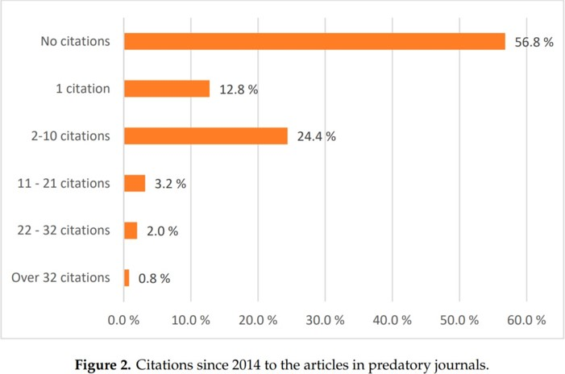
:::

## 

::: center

:::

## 

### Open Data & Open Materials 1/7

All the information underpinning your research can offer value to other researchers:

* raw and processed data,
* protocols and methods,
* machine and environment settings, and
* scripts and algorithms.

Sharing and using such research data can increase the impact, validity, reproducibility,  efficiency, and transparency of research.

## 

### Open Data & Open Materials 2/7

Good data management supports discovering.

Good data management is not a goal in itself, but rather is the key conduit leading to knowledge discovery and  innovation, and to subsequent data and knowledge integration and reuse by the community after the data  publication process.

To unlock the true potential of research data, we need to move beyond solely making data available.

<p align="middle">
   
</p>


## 

### Open Data & Open Materials 3/7

**Metadata**

i.e., Data that provides information about other data

Descriptive metadata describes a resource for purposes such as discovery and identification. It  can include elements such as title, abstract, author, and keywords.

Structural metadata is metadata about containers of metadata and indicates how compound  objects are put together, for example, how pages are ordered to form chapters.

Administrative metadata provides information to help manage a resource, such as when and how  it was created, file type and other technical information, and who can access it.

## 

### Open Data & Open Materials 4/7

The **FAIR Guiding Principles** 

_To be Findable_:

F1. (meta)data are assigned a globally unique and persistent identifier

F2. data are described with rich metadata (defined by R1 below)

F3. metadata clearly and explicitly include the identifier of the data it describes

F4. (meta)data are registered or indexed in a searchable resource

## 

### Open Data & Open Materials 5/7

The **FAIR Guiding Principles** 

_To be Accessible_:

A1. (meta)data are retrievable by their identifier using a standardized communications protocol

A1.1 the protocol is open, free, and universally implementable

A1.2 the protocol allows for an authentication and authorization procedure, where necessary

A2. metadata are accessible, even when the data are no longer available

## 

### Open Data & Open Materials 6/7

The **FAIR Guiding Principles** 

_To be Interoperable_:

I1. (meta)data use a formal, accessible, shared, and broadly applicable language for knowledge representation.

I2. (meta)data use vocabularies that follow FAIR principles

I3. (meta)data include qualified references to other (meta)data

##

### Open Data & Open Materials 7/7

The **FAIR Guiding Principles** 

_To be Reusable_:

R1. meta(data) are richly described with a plurality of accurate and relevant attributes

R1.1. (meta)data are released with a clear and accessible data usage license

R1.2. (meta)data are associated with detailed provenance

R1.3. (meta)data meet domain-relevant community standards

## 

::: center

:::

## 

### Open Source Software (OSS)

OSS management and workflow is an emerging but critical component of Open Science

* Free of charge

* Easier to replicate research

* Easier to share

* Skills transferable almost anywhere

## 

::: center

:::

## 

### What is pre-registration? 1/3

When you preregister your research, you're simply specifying your research plan in advance of your study  and submitting it to a registry.

Preregistration separates hypothesis-generating (exploratory) from hypothesis-testing (confirmatory) research.

Both are important. But the same data cannot be used to generate and test a hypothesis.

Addressing this problem through planning improves the quality and transparency of your research.

## 

### What is pre-registration? 2/3

<table border="0">
 <tr>
    <td><b style="font-size:30px">Confirmatory research</b></td>
    <td><b style="font-size:30px">Exploratory research</b></td>
 </tr>
 <tr>
    <td>
    - Hypothesis testing
    
    - Results are held to the highest standards
    
    - Data-independent
    
    - Minimizes false positives
    
    - P-values retain diagnostic value
    
    - Inferences may be drawn to wider population

</td>
    <td>
      - Hypothesis generating

  - Results deserve to be replicated and confirmed

- Data-dependent

- Minimizes false negatives in order to find unexpected  discoveries

- P-values lose diagnostic value

- Not useful for making inferences to any wider  population
    </td>
 </tr>
</table>

## 

### What is pre-registration? 3/3

**When Can You Preregister?**

- Right before your next round of data collection

- After you are asked to collect more data in peer review

- Before you begin analysis of an existing data set

**Why Preregister?**

- Makes your science better by increasing the credibility of your results

- Allows you to stake your claim to your ideas earlier

- It's an easy way to plan for better research

## Open-Science is the future!

**European  mandate**

As of the Work Programme 2017

the Open Research Data pilot is extended to  cover all
thematic areas of Horizon 2020  per default.

However, the Commission recognizes that  some research data cannot
be made open  and applies the principle of
'as open as possible, as closed as necessary’.

It is therefore possible to opt out of
research data sharing at any stage - before  or
after the signature of the grant agreement - but reasons have to be given


## Thank you for your attention!

Questions?

[`r fa(name = "github")` repository](https://github.com/michelescandola/multiverse_analysis) https://github.com/michelescandola/multiverse_analysis


<p style="margin-bottom:3cm;">

</p>

_Thanks to Daniele Romano, Milano-Bicocca University_


## References
